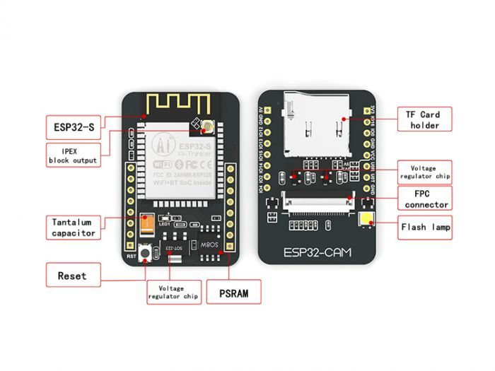

# ESP32SecurityCam
A scalable network of security cameras based on an ESP32 Cam.

### [ESP32CamNode](https://github.com/MicroJEdi/ESP32CamNode) is the repository containing the backend central authority that aggregates and persists all of the data.
